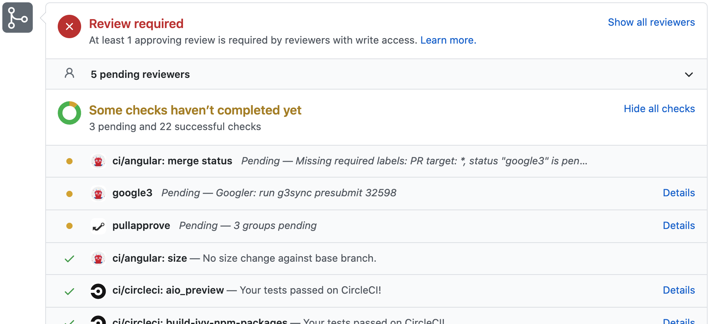

# standard-version 소개

lerna에는 커밋 메시지를 읽어 자동으로 새로운 버전과 CHANGELOG를 작성하고 git 태그를 작성해 주는 기능(이하 버전 자동화)도 포함되어 있는데. 이 기능을 활용하면 운영에 큰 도움이 된다.

이 기능을 사용하려면 **--conventional-commits** 인자를 전달해야 한다. 이름에서 알 수 있듯 이 기능을 사용하려면 커밋 메시지들을 [Conventional Commit](https://www.conventionalcommits.org/ko/v1.0.0/)컨벤션에 맞춰 작성해야 한다.

lerna말고도 같은 기능을 제공하는 도구가 몇개 있는데. 그 중 [standard-version](https://github.com/conventional-changelog/standard-version)은 단일 리포지토리에 버전 자동화를 제공하는 도구이다.

이 도구는 태생 자체가 버전 자동화라서 lerna보다 **직관적이고. 다루기 쉽고. 조금 더 다양한 기능들을 제공**한다. 만들어 내는 태그의 커밋 메시지 포멧을 변경하거나 changelog를 뽑아 API를 호출하는 등 여러가지로 응용할 수 있다.

이 글에서는 최근에 이 **standard-version**을 이용해 사내 서비스 배포와 롤백 시스템을 구축했던 경험을 정리한다.

# 서비스를 위한 버전 자동화

지난 글 [모노레포 도입 검토](/post/앱과-라이브러리-관리에-Monorepo) 단계에서는 lerna를 완전히 적용하며 자동 버저닝을 서비스에서도 사용할 수 있을 것이라 예상했다.

하지만 **서비스들의 커밋이 섞여 각 담당자들이 라이브러리 수정 코드만을 보고 사이드 이펙트를 예측할 수 있을 지 확실하지 않다**는 문제로 진행하지 않기로 했고. 서비스는 다른 방법을 찾아야만 했다.


그 때 **Conventional Commit** 사이트에 소개된 툴 중에 **standard-version**을 도입하여 현재 문제 없이 운영하고 있다.

부끄러운 이야기지만 도입 전 약 5년 동안이나 프론트 코드의 롤백은 수동으로 할 수밖에 없었다. 대부분의 배포 후 사이드이펙트는 서버API의 문제였기 때문에 크게 필요성을 느끼지 못했던 부분도 있다.

하지만 FE개발파트가 커지고 사내 모든 서비스를 담당하게 되면서 시스템의 필요성이 생겨 지금에라도 도입하게 되었다.

# 새로 도입한 배포 프로세스

> 먼저 그림으로 보고 각 단계에서 하는 일들을 아래에서 설명한다


## 1. 기능 개발

커밋 메시지는 [Conventional Commit](https://www.conventionalcommits.org/ko/v1.0.0/)을 준수해야 한다. 작성이 어렵다면 도움을 주는 [commitizen](https://github.com/commitizen/cz-cli)을 사용하면 좋다. 만약 cli에 익숙하지 않다면 [어댑터](https://github.com/commitizen/cz-cli#adapters)를 사용하여 원하는 도구에서도 commitizen을 이용할 수 있다.

```bash
# 커밋 메시지 작성을 대화형으로 도와주는 도구 설치
npm install -g commitizen

# 프로젝트를 commitizen friendly 하게 만들어야 한다
commitizen init cz-conventional-changelog --save-dev --save-exact

# 설치하고 나면 아래 명령으로 커밋 메시지를 대화형 도구로 작성할 수 있다
git cz
Select the type of change that you're commiting: (use arrow keys)
> feat:     A new feature
  fix:      A bug fix
  docs:     Documentation only changes
  styles:   Changes that do not effect the meaning of the code
            (white-space, formatting, missing semi-colons, etc)
  refactor: A code change that neither fixes a bug or add a feature
  perf:     A code change that improves performance

```

커밋 전에 커밋 메시지들이 컨벤션에 맞게 작성되었는지 검사해 주면 좋다. [commitlint](https://github.com/conventional-changelog/commitlint)와 [husky](https://github.com/typicode/husky)를 이용한다.

```bash
# 커밋 시 커밋 메시지들을 검사하기 위한 도구 설치
npm install -D commitlint husky
```

```json
// package.json 에 커밋할 때 메시지들을 검사하도록 수정
{
  "husky": {
    "hooks": {
      "commit-msg": "commitlint -E HUSKY_GIT_PARAMS"
    }
  }
}
```

## 2. CI PR Check

Pull Request를 만들어 코드리뷰를 한다면 PR Check 기능을 이용해 커밋 메시지를 검사해 준다. 실수로 잘못된 커밋 메시지의 커밋이 푸시될 수 있기 때문이다. PR Check을 하지 않는다면 이 단계는 건너뛰고 다음 빌드 과정에서 하면 된다.



```bash
# 커밋 메시지들이 컨벤션에 맞게 작성되었는지 검사한다
git log -1 --pretty=format:"%s" | npx commitlint
```

## 3. CI 빌드 설정

> 전 단계를 건너뛰었다면 이 단계에서 커밋 메시지를 검사하도록 해 준다.

배포 빌드에서는 특정 커밋 메시지엔 빌드가 돌지 않도록 설정해야 한다. 위의 그림에서 **B-1**커밋은 개발 장비에서 배포를 위해 **standard-version**명령을 실행하여 package.json의 버전 범핑과 CHANGELOG.md의 수정사항 커밋이 추가된 경우인데 이때 빌드는 무의미하다.

JENKINS기준으로는 **Git Plugin** > **Polling ignores commits with certain messages** 항목을 추가하고 값은 `(?s).*chore\(release\).*`로 설정하면 된다. 비슷한 기능을 Git Actions, Travis나 Circie 에서도 지원하므로 똑같이 설정하면 된다.

## 4. CDN 업로드

CI가 만든 css, js, jpg, html등의 리소스 파일을 CDN에 업로드하도록 한다. 이 때 서비스가 여러개라면 겹치지 않도록 나누어야 한다. 또 테스트 서버가 여럿이라면 또 페이즈별로 겹치지 않도록 폴더를 나누어 주어야 할 것이다. 아래는 실제로 사용하고 있는 주소의 형태를 변형한 예제이다.

> **서비스 A 페이즈: beta**
>
> 1. `https://mycdn.net/mycompany/service-a/beta/2b30274/`
>
>    위 경로에 빌드 결과물들을 업로드한다.
>
> 2. `https://mycdn.net/mycompany/service-a/beta/latest`
>
>    이 파일에는 1번의 url (최신 버전이 무엇인지)를 기록해 둔다
>
> **서비스: B, 페이즈: real**
>
> 1. `https://mycdn.net/mycompany/service-b/real/2b30274/`
> 2. `https://mycdn.net/mycompany/service-b/real/latest`

> 이 단계에서는 **빌드 결과물을 어디에 그리고 얼마동안 보관해야 하는지**에 대한 고민이 있었다. 나의 경우 사내 인프라로 CDN이 제공되고 있었고 용량이 무제한이라 CDN에 저장하기로 했고 오래된 빌드를 따로 삭제하지는 않았다. 다만 CDN은 위처럼 빌드 결과물의 경로를 신경써야 한다. 하지만 NPM을 사용한다면 압축 파일을 풀면 바로 결과물을 확인할 수 있기 때문에 이후 배포 과정의 스크립트를 더 단순하게 작성할 수 있다.

## 5. 배포 및 버저닝

### 웹 서버에 리소스 배포하기

이 단계에서는 CDN으로부터 최신 버전의 index.html파일을 받아 웹서버에 배포한다. 최신버전은 전 단계의 url을 보면 알 수 있듯 **서비스명/페이즈/latest** 규칙이다. 배포 스크립트는 각 환경에 맞게 작성하면 된다.

```bash
# CDN에 업로드 한 latest파일의 내용에는 최신버전 패키지의 주소가 적혀 있다
PACKAGE_DIR=$(curl https://mycdn.net/mycompany/$SERVICE/$PHASE/latest)

# 그러므로 latest파일의 내용(최신버전 index.html이 있는 CDN의 폴더 경로)
# 에 index.html을 붙이면 배포 대상이 된다
curl -o index.html $PACKAGE_DIR/index.html

# 최신 index.html을 웹 서버에 배포한다
curl -T index.html -u userid:passswd ftp://10.10.1.55/www/publish
```

위의 파일을 만들어 두고 `SERVICE=service-a PHASE=beta sh deploy.sh` 로 실행하면 배포할 수 있다.

혹시 index.html만을 배포하는 이유를 궁금해할 수 있을 듯 한데. 내용을 보면 이해할 수 있을 것이다.

```html
<!DOCTYPE html>
<html>
  <head>
    <title>Service A App</title>
  </head>
  <body>
    <app-root></app-root>
    <script src="https://mycdn.net/mycompany/service-a/real/2b30274/main.js"></script>
    <script src="https://mycdn.net/mycompany/service-a/real/2b30274/polyfill.js"></script>
    <script src="https://mycdn.net/mycompany/service-a/real/2b30274/vendor.js"></script>
    <script src="https://mycdn.net/mycompany/service-a/real/2b30274/common.js"></script>
  </body>
</html>
```

angular는 빌드할 때 --deploy-url인자를 전달하면 만들어내는 index.html에 위와 같이 script src들과 내부에서 쓰는 css의 url에 prefix(예제에서는 `https://mycdn.net/mycompany/service-a/real/2b30274/`) 를 붙여 준다.

따라서 index.html만 배포해도 된다. 만약 상대경로로 포함하는 방식이라면 관련 파일을 모두 업로드하도록 스크립트를 작성하면 된다.

### real 페이즈 배포 후 버저닝

> ⚠️ 이 과정은 테스트 서버들이 아닌 real 페이즈 배포 직후에만 실행한다. 이유는 develop, master에서 자동 버저닝을 수행하면 중복된 태그를 생성할 수 있기 때문이다.

> **--prerelease** 인자를 사용하면 **v1.3.1-alpha.0** 형태의 태그를 만들 수 있다. 테스트 서버 브랜치에서는 배포시 이 인자를 사용하면 리얼 브랜치와 태그가 겹치는 것을 예방할 수 있을 것으로 보이지만 필요한 부분이 아니라 추가 검토는 하지 않았다.

만약 real에 배포했다면 버저닝을 할 차례이다. 이는 뒤에서 설명할 롤백을 위해 꼭 필요한 과정으로 **standard-version**을 이용할 것이다.

```bash
# 버저닝은 배포할 브랜치에서 수행해야만 한다
git checkout master
git pull
npx git-branch-is master

# 자동 버저닝
standard-version \
  --release-as=minor \
  --releaseCommitMessageFormat="chore(release): {{currentTag}}\n[[$deployUrl]]"

# package.json, CHANGELOG.md파일의 수정사항과 새 태그를 함께 푸시한다
git push origin HEAD --follow-tags --no-verify
```

**release-as** 인자는 혹시 모를 핫픽스를 위함이다. 서비스의 배포는 minor이상을 올려야 patch로 긴급 배포를 할 수 있게 된다. 어제 1.1.0 을 배포하고 오늘 1.2.0 을 배포했는데. 1.1.0 기준으로 핫픽스를 배포해야 한다면 1.1.0 에서 브랜치를 따고 1.1.1로 배포하면 된다.

**releaseCommitMessageFormat**인자로 기본값 뒤에 개행과 **[[$deployUrl]]**를 붙여 주었다. 이는 롤백을 위해 필요한 부분인데 이어지는 섹션에서 설명한다.

# 롤백 프로세스


real배포를 하면 태그가 쌓일 것이다 아래 명령으로 조회할 수 있다. v1.3.0로 롤백을 원한다고 가정해 보자.

```bash
g tag --sort=-committerdate -l "v*"

v1.3.1
v1.3.0
v1.2.5
v1.2.4
v1.2.3
v1.2.2
v1.2.1
v1.2.0
v1.0.0
(END)
```

v1.3.1의 태그 커밋 메시지에는 배포 단계에서 넣어주었던 **[[$deployUrl]]**이 기록되어 있을 것이다.

```bash
git tag -l --format='%(contents)' v1.3.1

v1.3.1

[[https://mycdn.com/myapp/eff782/]]
```

**deployUrl**은 index.html을 포함한 빌드 결과물들이 있는 CDN폴더 주소이다. url을 추출해 index.html을 붙여준 파일을 다운로드 하여 배포하면 롤백이 완료된다.

```bash
CONTENT=$(git tag -l --format='%(contents)' v1.3.1)
DEPLOY_URL=$(node -p "'$CONTENT'.match(/\[\[\d\]\/])[1]")

curl -o index.html $DEPLOY_URL/index.html
curl -T index.html -u userid:passswd ftp://10.10.1.55/www/publish
```

# 요약 및 기타 고려사항

일단 내용을 짧게 요약하자면 다음과 같다.

- 리얼 배포 시점에 **standard-version**으로 버전 자동화를 적용한다
- 버전 자동화 중에 추가로 CDN에 업로드 된 빌드 결과물의 주소를 태그에 기록한다
- 롤백할 땐 원하는 태그의 메시지를 읽어 특정 포멧으로 기록된 CDN주소의 결과물을 배포하면 된다

이번 개선 작업에서 하지 못한 작업들도 있다. 빠른 시일 내에 추가 적용하려고 한다.

- **standard-version**은 changelog 훅도 제공하고 있어 배포 시점에 이메일로 변경사항을 공유하는 등의 작업이 가능할 것으로 보인다.

글에서 소개한 배포 및 롤백 프로세스의 경우 쉘 스크립트를 작성하고 이를 package.json에 등록해 사용하는 편이 좋겠다.

사내에서는 배포 및 롤백 스크립트 포함된 태스크 러너를 nodejs기반 cli로 만들어 사용하고 있다. 기회가 된다면 관련해서도 글을 쓸 예정이다.

혹시 내용관련 궁금한 사항이 있다면 [이메일](mailto:romz1212@gmail.com)을 보내 주기 바란다.
